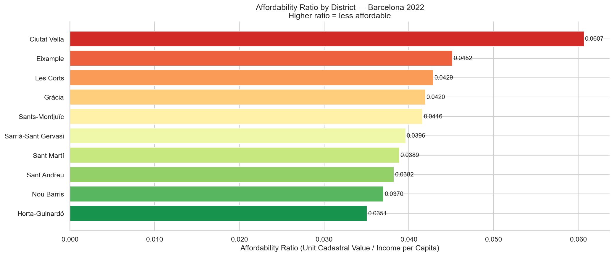
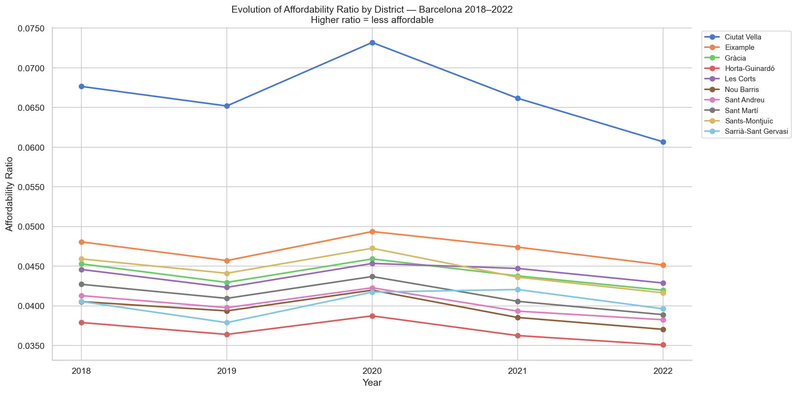
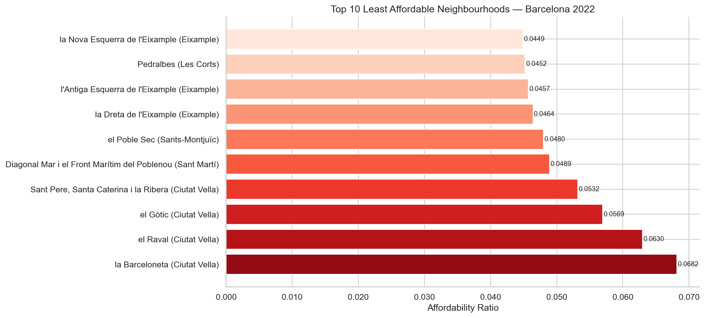
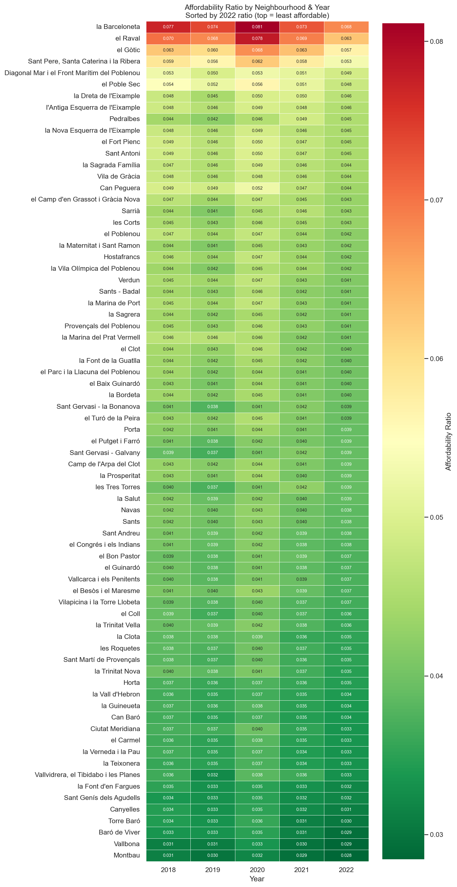
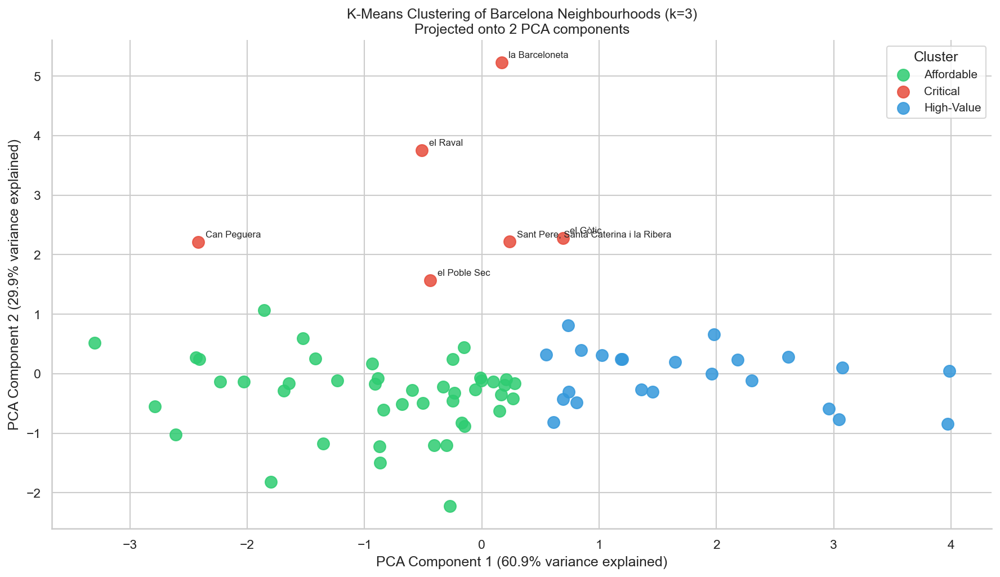
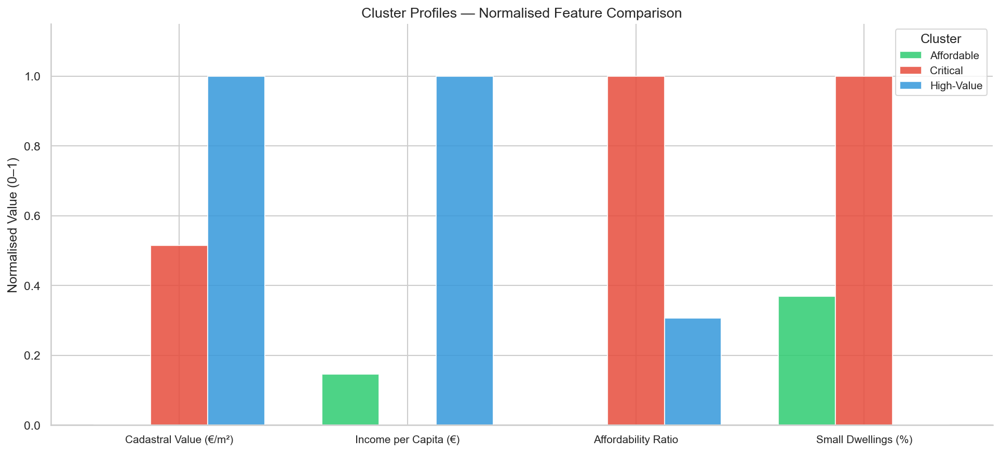

# Barcelona Housing Affordability Analysis

Analysis of housing affordability in Barcelona (2018–2022) using open data from the Barcelona City Council. The project explores the relationship between cadastral property values, dwelling size distribution, and household income across the city's 10 districts and 73 neighbourhoods.

## Motivation

Housing affordability is one of the most pressing social issues in Barcelona. This project uses publicly available data to quantify and visualise the structural inequality in access to housing across the city, identifying which districts and neighbourhoods face the greatest affordability pressure.

## Data Sources

All datasets are sourced from [Open Data Barcelona](https://opendata-ajuntament.barcelona.cat) (Ajuntament de Barcelona) under a Creative Commons Attribution 4.0 licence.

| Dataset | Description | Period |
|---|---|---|
| Cadastral values of housing premises | Unit and total cadastral value (€/m²) by census section | 2018–2022 |
| Housing premises by surface area | Number of dwellings by size range per census section | 2018–2022 |
| Household disposable income per capita | Estimated income per person (€) by census section | 2018–2022 |

> **Note:** Cadastral values are fiscal estimates updated infrequently and sit below market prices. They serve as a relative proxy for comparing districts rather than as absolute market indicators.

## Tech Stack

- **Python** — pandas, numpy, sqlite3, matplotlib, seaborn, scikit-learn, ipywidgets
- **SQL** — SQLite (joins, aggregations, subqueries, CASE expressions)
- **Environment** — Jupyter Notebook

## Project Structure

```
barcelona-housing-affordability-analysis/
│
├── data/
│   ├── raw/
│   │   ├── cadastral_values/
│   │   ├── housing_surface/
│   │   └── household_income/
│   └── processed/
│
├── notebooks/
│   ├── 01_data_loading_and_sql.ipynb
│   ├── 02_eda_and_cleaning.ipynb
│   ├── 03_affordability_analysis.ipynb
│   └── 04_clustering.ipynb
│
├── visualizations/
├── README.md
└── requirements.txt
```

## Notebooks

| Notebook | Status | Description |
|---|---|---|
| 01 · Data Loading & SQL | ✅ Complete | Data ingestion, column standardisation, SQLite database creation, SQL exploration queries |
| 02 · EDA & Cleaning | ✅ Complete | Missing value analysis, outlier detection, feature engineering |
| 03 · Affordability Analysis | ✅ Complete | Affordability index, district and neighbourhood visualisations |
| 04 · Clustering | ✅ Complete | K-Means clustering, PCA visualisation, interactive affordability explorer |

## Key Findings

### Notebook 01 — Data Loading & SQL

- **Cadastral values are structurally stable** across all districts (+0.06% to +0.66% over 2018–2022), confirming their nature as fiscal rather than market indicators.
- **Income growth is unequal.** Lower-income districts show higher relative growth (Ciutat Vella +11.2%) but from a much lower base. Sarrià-Sant Gervasi, the wealthiest district, grew only +1.6%.
- **Small dwelling concentration reveals residential segregation.** Ciutat Vella (52.9%) and Nou Barris (42.9%) have the highest share of dwellings under 60m² — and also the lowest household incomes. La Barceloneta is the most extreme case at 76.9%.
- **This pattern is structurally persistent.** The share of small dwellings barely changed across any district over five years.

### Notebook 03 — Affordability Analysis

- **Ciutat Vella is the least affordable district by a significant margin.** With an affordability ratio of 0.061 in 2022, it stands well above the rest. La Barceloneta (0.068) and el Raval (0.063) are the two least affordable neighbourhoods in the city.
- **The COVID-19 effect is visible in the data.** All districts show a peak in affordability ratio in 2020, driven by income falling faster than cadastral values during the pandemic. Ciutat Vella was the most affected, reaching 0.073 that year.
- **"Affordable" does not mean high income.** The most affordable census sections have the lowest median income (~€21,000). Affordability here reflects low cadastral values, not purchasing power.
- **Small dwellings and low affordability are structurally linked.** La Barceloneta combines the highest affordability ratio (0.068) with the highest share of small dwellings (80%).
- **The inequality is persistent across all five years analysed.** The ranking of neighbourhoods by affordability ratio barely changed over the period.

### Notebook 04 — Clustering

- **K-Means with k=3 is the optimal solution**, confirmed by both the Elbow Method and the Silhouette Score (0.39 at k=3).
- **Three distinct affordability profiles emerge:** Affordable (44 neighbourhoods), Critical (6 neighbourhoods) and High-Value (23 neighbourhoods).
- **The Critical cluster is geographically concentrated in Ciutat Vella.** 4 of the 6 critical neighbourhoods (la Barceloneta, el Raval, el Gòtic, Sant Pere/Santa Caterina/la Ribera) belong to the same district.
- **High cadastral value alone does not define affordability pressure.** The High-Value cluster has the highest prices (€1,206/m²) but also the highest income (€28,921), resulting in a low affordability ratio — similar to the Affordable cluster.
- **PCA confirms cluster quality.** Two principal components explain 90.8% of total variance and the three clusters are clearly separated in PCA space.

## Visualisations

[](https://mybinder.org/v2/gh/oscarrhdatascience/barcelona-housing-affordability-analysis/main?filepath=notebooks/04_clustering.ipynb)

> **Interactive widget (notebook 04):** click the Binder badge to launch the notebook in the cloud. Once loaded, go to **Kernel → Restart & Run All** to activate the interactive affordability explorer.













## How to Run

```bash
git clone https://github.com/oscarrhdatascience/barcelona-housing-affordability-analysis.git
cd barcelona-housing-affordability-analysis
pip install -r requirements.txt
```

Download the raw datasets from [Open Data Barcelona](https://opendata-ajuntament.barcelona.cat) and place them in the corresponding folders under `data/raw/` before running the notebooks.

## Author

**Óscar Rodríguez Hernández**  
[LinkedIn](https://www.linkedin.com/in/oscar-rh-data-science) · [GitHub](https://github.com/oscarrhdatascience)